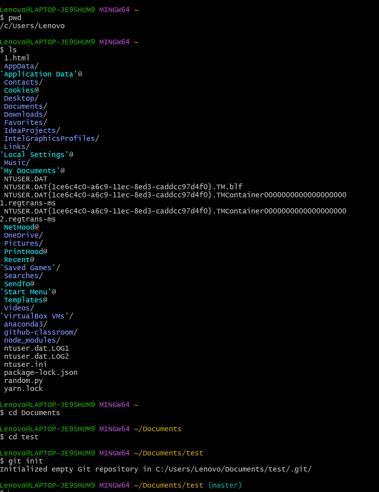
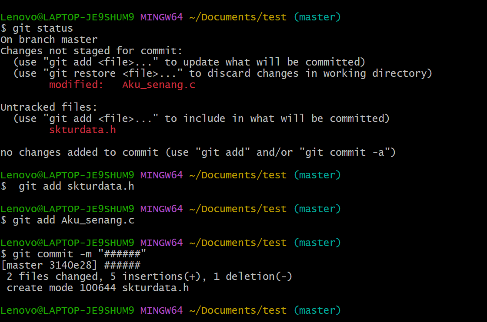
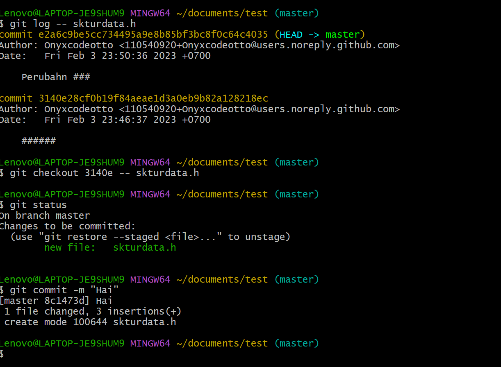

# Bekerja dengan Git

## A. Install Git
Penginstallan GIt dapat dilakukan di situs git-scm.com
Centang install git bash pada penginstalan git, yaitu command prompt khusus untuk penggunaan git
Namun pada penginstalan git, akan diberi opsi apakah ingin dapat menggunakan git pada commmand line pihak ketiga.

## B. GitBash
Command
Git: Memeriksa perintah pada git
clear: membersihkan teks
git init: inisialisasi repo git
git add: Menambahkan file pada staging area
git status: untuk mengetahui status repo
git commit: commit
git config: Konfigurasi git
git branch: Membuat branch
git help: Memberikan perintah-perintah git

Git akan mengenali 3 area jika dibuat sebuah repo
1. Working tree
Folder yang berisi file-file suatu project
2. Staging area
Memberi tahu git mengenai perubahan perubahan yang 
3. History
Menyimpan data commit

Staging area dan history akan disimpan dalam folder .git.

Perubahan yang dilakukan disimpan ke dalam staging area menggunakan perintah git add.
Untuk menyimpan perubahan ke dalam history, gunakan git commit.

## C.Bekerja dengan git

### Membuat repo baru baru
1. Buka gitbash
2. Ubah alamat pada gitbash menjadi alamat folder yang ingin dijadikan sebagai repository menggunakan perintah cd untuk menuju folder (contoh: cd Downloads) dan ls untuk melihat pilihan folder yang tersedia.
3. Ketik command "git init" untuk mengubah directory tersebut menjadi repository

### Proses menambah file
1. Ubah atau tambah file pada sebuah repository. Ketika file disimpan dalam folder, git belum mengetahui adanyan file tersebut. Untuk memeriksanya gunakan command git status.
2. Gunakan perintah git add filename untuk mengkonfirmasi file ke staging area. Gunakan perintah git rm untuk meng-undonya.
3. Sebelum commit, git meminta identitas orang yang mengcommit. 
4. Gunakan perintah git commit -m "Pesan commit" untuk mengcommit file tersebut

Untuk memeriksa perubahan sebuah file dalam sebuah repo, gunakan command git log -- \<filename\>
### Checkout
1. Untuk mengembalikan perubahan pada suatu file, gunakan git checkout \<commit hash\> -- \<filename\>. File akan disimpan di staging area
2. Lakukan commit untuk menyimpan perubahannya

## D. Screenshot

