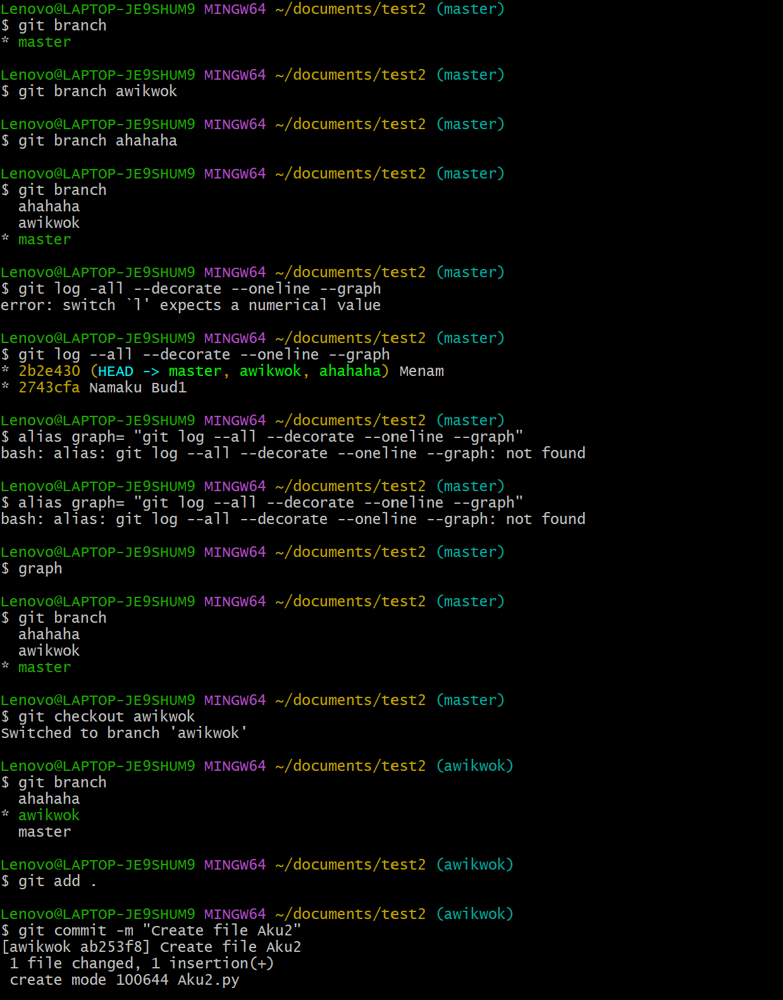
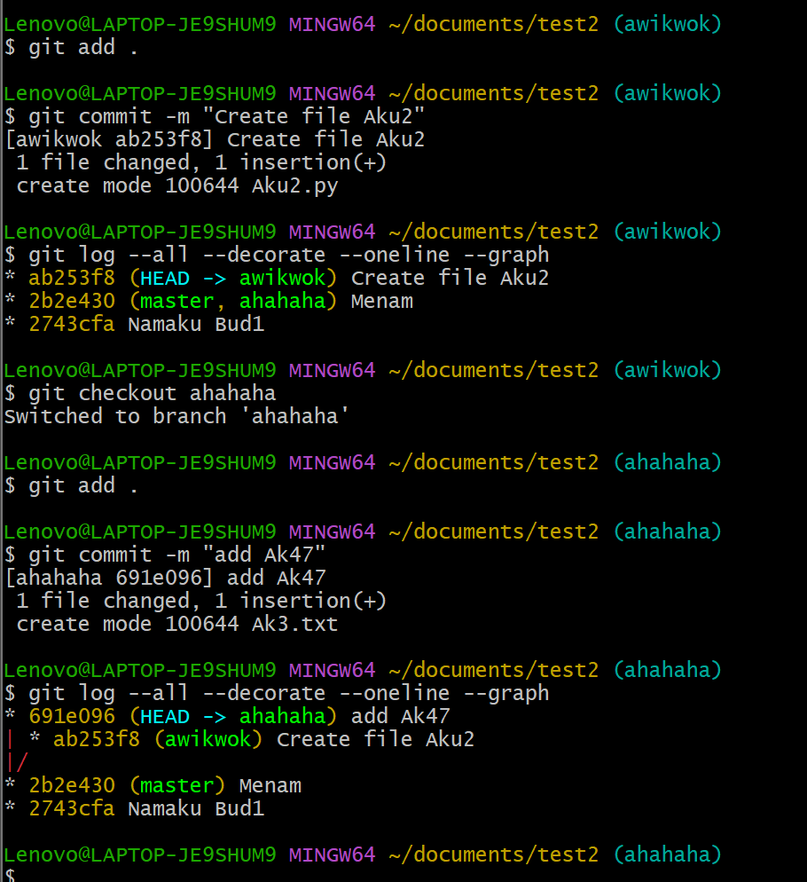
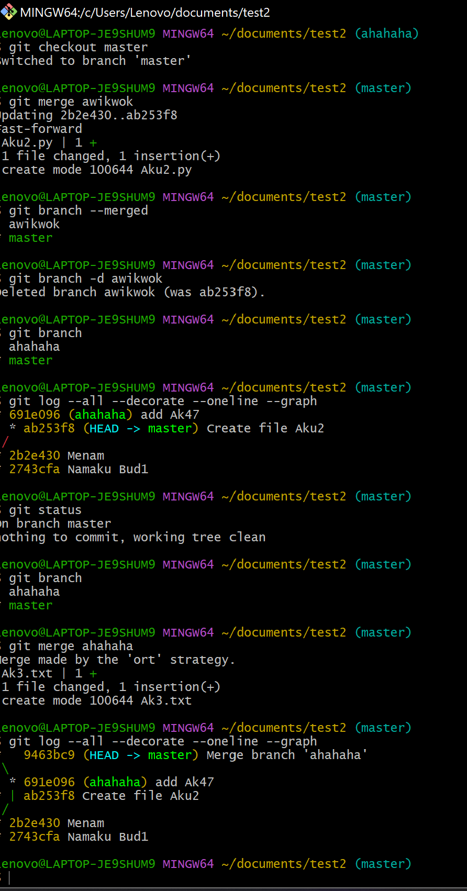

# Git Branch & Merge  

Pada sebuah commit, terdapat sebuah branch yang mengarah kepadanya.
Head adalah pointer yang menunjuk branch yang aktif pada sebuah commit.

## A. Implementasi branch
#### a. Command: 
git branch: Menampilkan semua branch.
git branch <branchname>: Membuat sebuah branch.
git checkout <branchName>: Pada commit yang sama pointer head akan menunjuk branchName.
git branch -d <branchName>: Menghapus branch yang tidak digunakan.
#### b. Pembuatan branch baru
1. Gunakan command git branch <branchname> untuk membuat branch.
2. Gunakan command git checkout <branchName> untuk membuat head menunjuk branchName.
3. Lakukan commit untuk membuat cabang.

## B. Implementasi merge
Terdapat dua jenis merge
1. Fast Foward Merge: Terjadi jika dua branch yang di merge berada dalam satu path commit (branch utama dibelakang branch yang akan di merge dalam history commit)  
2. Three-way merge: Terjadi jika dua branch yang akan di merge tidak berada dalam satu path commit 
Commandnya sama, hanya saja path commitnya akan berbeda.

## C. Merging
i. Ubah head untuk menunjuk branch utama yang akan di merge
ii. Gunakan command git merge <otherBranch>
#### a.Menghapus branch
i. Setelah merge gunakan command git branch -d <branchName>. Jika belum dimerge gunakan command git branch -D <branchName> untuk menghapus secara paksa.

## D. Screenshot

