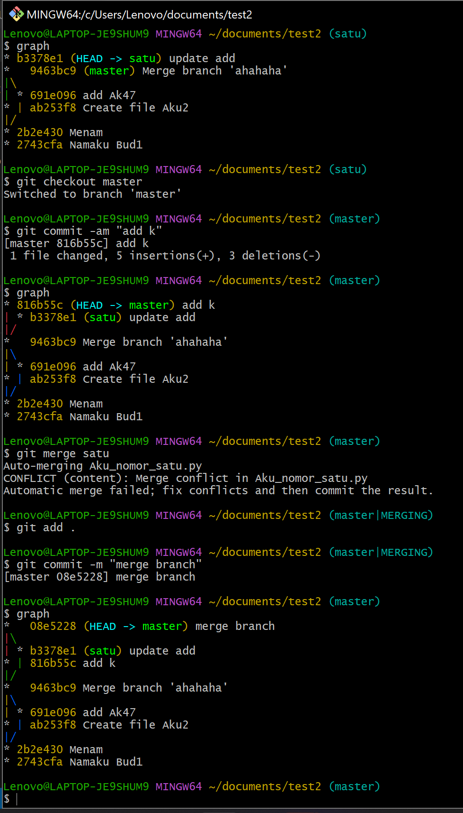

# Git Merge Conflict
Merge conflict terjadi ketika dua branch mengerjakan fitur yang sama pada sebuah repository.

## A. Cara resolve merge conflict
1. Lakukan merge biasa pada dua buah branch
2. Jika conflict buka file yang conflict pada code editor
3. Code editor akan menampilkan kode-kode yang conflict. Selesaikan conflict tersebut sesuai dengan kode yang diinginkan.
4. Lakukan commit

## B. Cara pindah ke commit tertentu
1. Cari hash dari commit yang ingin dikembalikan
2. gunakan command git checkout \<hash\>
3. Jika commit tersbebut ingin dibuat menjadi branch, gunakan git branch \<newBranch\>.

## C. Screenshot
